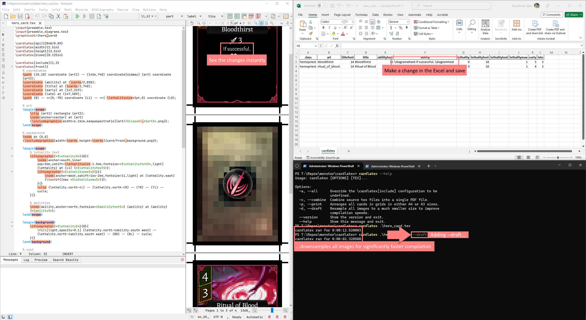

# cardlatex

**cardlatex** is a XeLaTeX wrapper which compiles TeX from specific templated `.tex` and `.xlsx` files. Both `.tex` and `.xlsx` must share the same file name.

**Please note this is a pre-release.**


---


---



---


---

## Getting started

### Prerequisites

To get started with **cardlatex**, you'll need:

* [MiKTeX](https://miktex.org/download)
* [ImageMagick](https://imagemagick.org/script/download.php) (make sure to check `Install development headers and libraries for C and C++`)
* [Python](https://www.python.org/downloads/) (>=3.10, use `python --version` to check)
* [TeXstudio](https://www.texstudio.org/) (optional; if you do, import our helpful [TeXstudio macros](texstudio/))

After these prerequisites are installed, in a terminal:

```commandline
pip install cardlatex
```

#### **OR**

If you are using Windows, you can simply install the Windows package manager [Chocolatey](https://chocolatey.org/install#individual), then:


```commandline
choco install miktex.install
choco install imagemagick.app --params InstallDevelopmentHeaders=true
choco install cardlatex --source python
'optional'
choco install texstudio.install
```

## Example

```
project/
├── card.tex
├── card.xlsx
└── art/
    └── background.png
```

`card.tex`

```latex
\cardlatex[width]{2cm}
\cardlatex[height]{3cm}
\cardlatex[bleed]{0.125in}
\cardlatex[include]{1...2,4}
\cardlatex[front]{
    \node[anchor=north west] at (0,0) {\includegraphics[width=\cardx]{art/<$art$>.png}};
    \if<$title$>{
        \node[anchor=north,yshift=-0.5cm,white] at (T) {\textbf{<$title$>}};
    }{}
}
```

Our card is 2 cm by 3 cm with a 0.125in bleed. We are only interested in compiling rows 1, 2 and 4.

`card.xlsx`

| art        | title     |   
|------------|-----------|
| background | Yesterday | 
| background | Today     |  
| background | Tomorrow  | 
| background | Future    |

In directory in which these files exist, we run:

```commandline
cardlatex card.tex --draft
```

This will output three new files:

```
project/
├── card.tex
├── card.xlsx
├── card.cardlatex.tex (the .tex file that is actually compiled with xelatex.exe)
├── card.pdf (the resulting .pdf file)
└── card.log (the .log file, in case any errors occur)
```

## Documentation

## `.tex` configurations

Configurations are defined in the `.tex` document. Defining the same variable more than once is an error.

**Do not use TeX macros or placeholder variables in any configuration other than `front` and `back`.**

- `width (length)`: `required` Width of the card.
- `height (length)`: `required` Height of the card.
- `dpi (number)`: `default = 0` Calculate by dividing the pixels in width or height with the width or height in inches. 
This is helpful when defining pixel-perfect coordinate positioning. If your background image has a resolution of 2048 pixels, and your card is 3.5in, `\cardlatex[dpi]{2048/3.5}` will have a node at `(300, -300)` (with no length hint) will be positioned at 300 pixels from the top left.
- `bleed (length)`: `default = 0` Bleed margin of the card.

[//]: # (- `spacing &#40;length&#41;`: `default = 0` Spacing between cards when `--print` is used.)
- `include (numbers)`: Compile only specific rows. If left undefined, all rows in the XML are compiled. Accepts numbers `n > 0` and ranges `i...j`.
- `front (text)`: `required` Front template of the card. May contain any TeX, TikZ and placeholder variables `<$var$>`.
- `back (text)`: Back template of the card. May contain any TeX, TikZ and placeholder variables `<$var$>`.

Any additional TeX will be run as normal, but using the `\begin{document}` environment is an error.
For example, you can write additional `\newcommand` macros for your template, or prepare TikZ with `\tikzset` or `\tikzmath`.

Note that `\input{other.tex}` functions, but using `\include{other.tex}` is an error.  

### TikZ macros

Some coordinates are preset, useful for anchoring other shapes. All coordinates are within the `bleed` margin.

* `C`: Center of card.
* `TL`: Top-left of card.
* `T`: Top-center of card.
* `TR`: Top-right of card.
* `R`: Right-center of card.
* `BR`: Bottom-right of card.
* `B`: Bottom-center of card.
* `BL`: Bottom-left of card.
* `L`: Left-center of card.

Some dimensions are also preset.

* `\bleed`: Bleed margin.
* `\cardx`: Width of card.
* `\cardy`: Height of card.

Two TikZ layers are included, `background` and `foreground`.

Finally, a `\tikzset` is preset for convenience, but can be overwritten:

```\tikzset{inner sep=0cm,outer sep=0cm,text badly ragged}```

**Example usage:**

```latex
\begin{foreground}
    \node[anchor=center,yshift=\bleed] at (C) {\includegraphics[width=2cm]{hero/<$class$>_symbol.png}};
\end{foreground}
```

## `.xlsx` data

Ensure the sheet name is `cardlatex`. 
The top row is reserved for the variable names used in your `.tex` templates with `<$variable$>`. 
Every subsequent row are the values of these placeholders. 
These placeholders only work within the `\cardlatex[front]` and `\cardlatex[back]` configurations.

## `cardlatex` command

Compiles `.tex`/`.xlsx` file pairs in your terminal.

`cardlatex [<tex file(s)>] [flags]`

### Flags

- `-c, --combine`: Combine all output PDF files to one. Has no effect if compiling only one `.tex` file.
- `-p, --print`: Grid each row to fit on A4 or A3 paper. (in the future, other paper sizes will be included)
- `-d, --draft`: Downsample all images for greatly improved compilation speed.
- `-a, --all`: Override `\cardlatex[include]` configuration to be undefined.

## Donate

Was this useful? Consider buying me a coffee!

[](https://ko-fi.com/H2H7PIMZR)